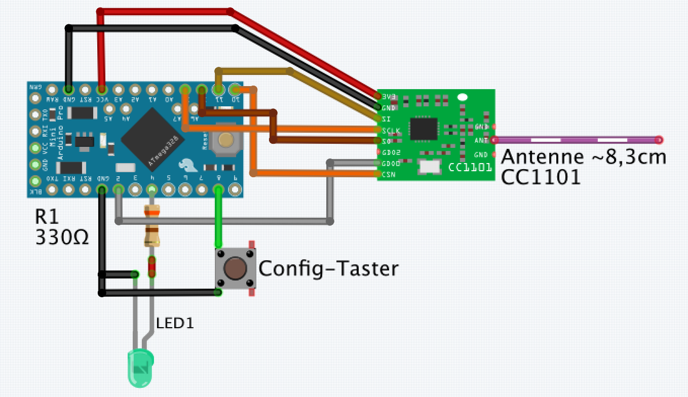
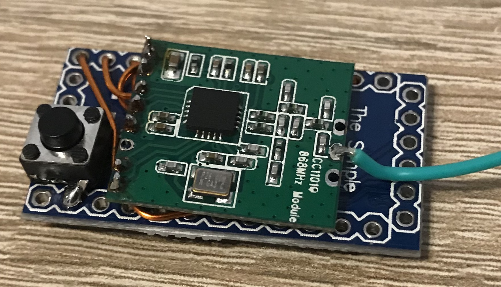
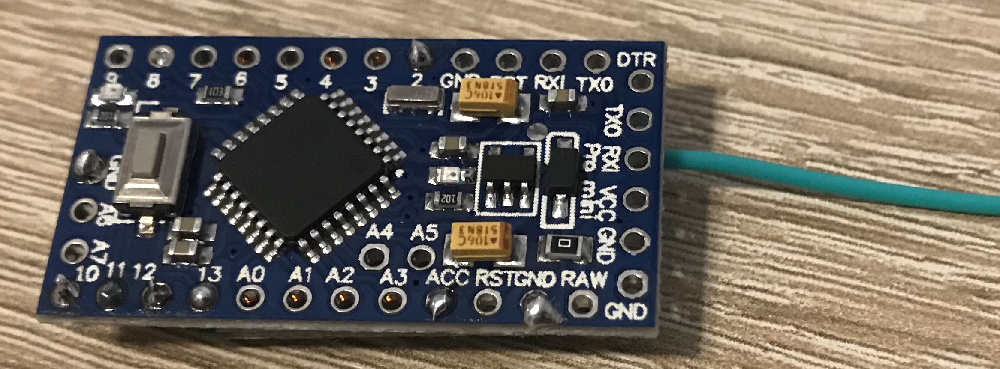

# Beispiel einer Umsetzung eines HM-[1-Kanal Senders](https://github.com/pa-pa/AskSinPP/tree/master/examples/HM-RC-P1) mittels Arduino Pro mini, CC1101 und [AskSinPP Library](https://github.com/pa-pa/AskSinPP).

## Hardwaresektion
### Bauteile
- 1x Arduino Pro Mini (3.3V 8MHz) (ca. 2,20 EUR bei [eBay](https://www.ebay.de/itm/272812248667))
- 1x CC1101 Funkmodul 868MHz (ca. 2,60 EUR bei [eBay](https://www.ebay.de/itm/272455136087))
- 1x Batteriehalter 2x AA (ca. 2,30 EUR bei [eBay](http://www.ebay.de/itm/200988520956)) 
- 1x FTDI Adapter (falls nicht schon vorhanden, gibts bei [Amazon](https://www.amazon.de/FT232RL-FTDI-USB-auf-TTL-Serienadapter-Arduino/dp/B00HSXDGOE))
- 2x Taster (beliebig, z.B. [Kurzhubtaster](https://www.ebay.de/itm/112592788992))
- 2x AA Batterien

### Verdrahtung

**Der Anschluss des Sende-Tasters**
- **erfolgt an A0 / GND!**

**_Mithilfe von Kupferlackdraht kann das Funkmodul platzspared "huckepack" am Arduino Pro Mini angeschlossen werden:_**

Unterseite:

### Anschluss des FTDI Adapters zum Flashen
- Um die Schaltung sehr kompakt zu halten, verzichte ich auf das Anlöten eines Steckverbinders. Es reicht aus, wenn man die Pins des FTDI Adapters durch die Lötbohrungen steckt. Während des Flash-Vorgangs verkantet man beide Platinen leicht, damit die Kontaktierung gegeben ist.

## Softwareabteilung
### Arduino IDE
- Arduino IDE [herunterladen](https://www.arduino.cc/en/Main/Software) und installieren
- AskSinPP Bibliothek als [ZIP herunterladen](https://github.com/pa-pa/AskSinPP/archive/master.zip) 
- notwendige Bibliotheken in der Arduino IDE hinzufügen:
  - Sketch -> Bibliothek einbinden -> .ZIP-Bibliothek hinzufügen
    - heruntergeladene AskSinPP Bibliothek ZIP-Datei auswählen
  - Sketch -> Bibliothek einbinden -> Bibliotheken verwalten
    - im Suchfeld folgende Bibliotheken suchen und installieren:
      - TimerOne
      - EnableInterrupt
      - Low-Power
 - Board einstellen:
  

    
