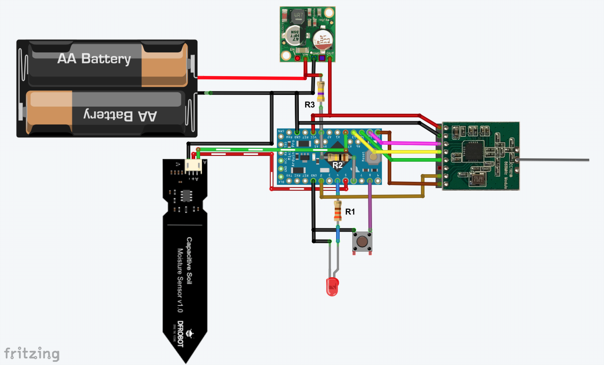
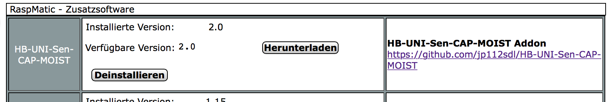
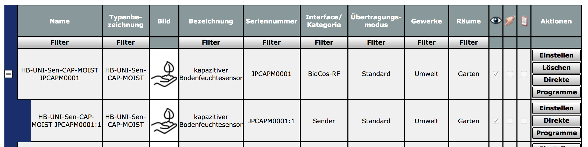
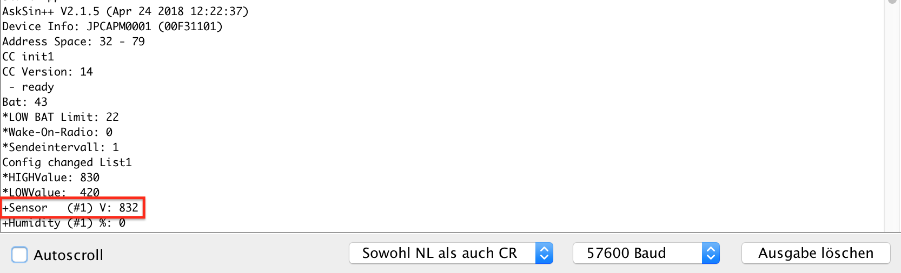

# HB-UNI-Sen-CAP-MOIST
## Funk "kapazitiver Bodenfeuchtesensor" für die Integration in HomeMatic
#### (mit bis zu 7 Sensoren pro Gerät)

## Verdrahtung 1 - mit StepUp

## Verdrahtung 2 - ohne StepUp

## benötigte Hardware
* 1x Arduino Pro Mini **ATmega328P (3.3V / 8MHz)**
* 1x CC1101 Funkmodul **(868 MHz)**
* 1x FTDI Adapter (wird nur zum Flashen benötigt)
* 1x Taster (beliebig... irgendwas, das beim Draufdrücken schließt :smiley:)
* 1x LED 
* 1x Widerstand 330 Ohm (R1)
* 1x Widerstand 100k (R2)
* 1x Widerstand 470k (R3)
* 1x ... 7x kapazitiver Feuchtesensor (0...3V Ausgangsspannung) [ebay](https://www.ebay.de/itm/152873639264)
* optional: 1x StepUp-Wandler **3.3V** (BL8530 o.ä.) [ebay](https://www.ebay.de/itm/382058974507)
* Draht, um die Komponenten zu verbinden

Um die Batterielebensdauer zu erhöhen, ist es unbedingt notwendig, die grüne LED vom Arduino Pro Mini mit einem kleinen Schraubendreher oder Messer von der Platine zu entfernen!

Die Schaltung mit StepUp-Converter ist wesentlich kompakter, da sie mit weniger Batterien auskommt. 
Wer aber möglichst wenig bauen/verdrahten möchte, ist auch mit der Variante 2 gut bedient. 
Es sind dann jedoch 3x AA(A)-Batterien (oder 4x 1.2V Akkus) notwendig. 
Der LDO auf dem Pro Mini kann lt. Datenblatt **max. 5.5V Eingangsspannung** vertragen. 
Mit 6V (4x AA Batterien) lief er im Feldversuch auch, was ich jedoch nicht empfehle. Vorzugsweise sind 3x AA Batterien (4.5V) zu verwenden oder 4x AA 1.2V-Akkus (4.8V).

## Universalplatine
Wer eine eigene Platine herstellen möchte, kann auf eine Auswahl verschiedener vorgefertigter Layouts zurückgreifen.
z.B.:
- [PCB](https://github.com/alexreinert/PCB) von alexreinert
- [HMSensor](https://github.com/pa-pa/HMSensor) von pa-pa

## Code flashen
- [AskSinPP Library](https://github.com/pa-pa/AskSinPP) in der Arduino IDE installieren
  - Achtung: Die Lib benötigt selbst auch noch weitere Bibliotheken, siehe [README](https://github.com/pa-pa/AskSinPP#required-additional-arduino-libraries).
- [Projekt-Datei](https://raw.githubusercontent.com/jp112sdl/HB-UNI-Sen-CAP-MOIST/master/HB-UNI-Sen-CAP-MOIST/HB-UNI-Sen-CAP-MOIST.ino) herunterladen.
- Arduino IDE öffnen
  - Heruntergeladene Projekt-Datei öffnen
  - Werkzeuge
    - Board: Arduino Pro or Pro Mini
    - Prozessor: ATmega328P (3.3V 8MHz) 
    - Port: entsprechend FTDI Adapter
einstellen
- ggf. Anpassungen im Code durchführen (z.B. bei mehreren Sensoren)
- Menü "Sketch" -> "Hochladen" auswählen.

## Addon installieren
In der CCU2 (oder RaspberryMatic) muss vor dem Anlernen noch ein Addon installiert werden. 
Dieses kann [hier](https://github.com/jp112sdl/HB-UNI-Sen-CAP-MOIST/raw/master/Addon/HB-UNI-Sen-CAP-MOIST-addon.tgz) heruntergeladen werden. 
_Hinweis: Die Datei darf nicht entpackt werden!_ 
Über "Einstellungen"->"Systemsteuerung"->"Zusatzsoftware" wählt man die Datei aus und klickt auf "Installieren".
Die CCU2 startet automatisch neu. 
**Achtung: Nachdem das System wieder hochgefahren ist, muss noch einmal ein Neustart erfolgen!** 
**"Einstellungen"->"Systemsteuerung"->"Zentralenwartung", Button "Neustart"** 
Nun ist das Addon einsatzbereit. 

## Gerät anlernen
Wenn alles korrekt verkabelt und das Addons installiert ist, kann das Gerät angelernt werden. 
Über den Button "Gerät anlernen" in der WebUI öffnet sich der Anlerndialog. 
Button "HM Gerät anlernen" startet den Anlernmodus. 
Nun ist der Taster (an Pin D8) kurz zu drücken. 
Die LED leuchtet für einen Moment. 
Anschließend ist das Gerät im Posteingang zu finden. 
Dort auf "Fertig" geklickt, wird es nun in der Geräteübersicht aufgeführt. 

  
## Kalibrierung
Der [Hersteller des Sensors](https://www.dfrobot.com/wiki/index.php/Capacitive_Soil_Moisture_Sensor_SKU:SEN0193) sieht eine manuelle Kalibrierung vor. 
Es müssen die Spannungswerte für beide Feuchte-Grenzen (trocken / nass) ermittelt werden. 
Der Wert wird beim Starten des Arduino Pro Mini im seriellen Monitor (57600 Baud) angezeigt. 
Siehe `+Sensor   (#n) V:`  

Zur Kalibrierung startet man nun den Arduino Pro Mini ein Mal mit trockenen Sensoren und ein Mal in ein Glas Wasser eingetaucht.
Dabei ergeben sich je Sensor 2 Werte: 
&nbsp;
 
_Der Wert im Trockenen muss höher sein als im Nassen!_

  
Beide Werte können nun in der WebUI-Gerätekonfiguration eingegeben werden.

## Einstellungen
- Gerät:
  - Low Bat Schwelle
    - mit StepUp: ~2.2V
    - ohne StepUp: ~3.7V
  - Das Sendeintervall kann zwischen 1 und 1440 Minuten eingestellt werden. 
- je Kanal:
  - HIGH Value ist der gemessene Analogwert, wenn der Sensor trocken ist. 
  - LOW Value ist der gemessene Analogwert, wenn der Sensor komplett nass (in Wasser eingetaucht) ist. 

  
## Wert anzeigen
Unter "Status und Bedienung" -> "Geräte" kann der Feuchtigkeitswert angezeigt werden. 
Damit man den Datenpunkt auch in Diagrammen verwenden kann, habe ich den systeminternen Datentyp `HUMIDITY` verwendet.
Das hat jedoch einen kleinen Schönheitsfehler zur Folge: Die Bezeichnung lautet "Rel. Luftfeuchte".
Damit kann man wohl leben... :) 

Eine Verwendung in Programmen ist ebenfalls möglich.

## Beispielaufbau
#### (einen Deckel drucke ich noch)

